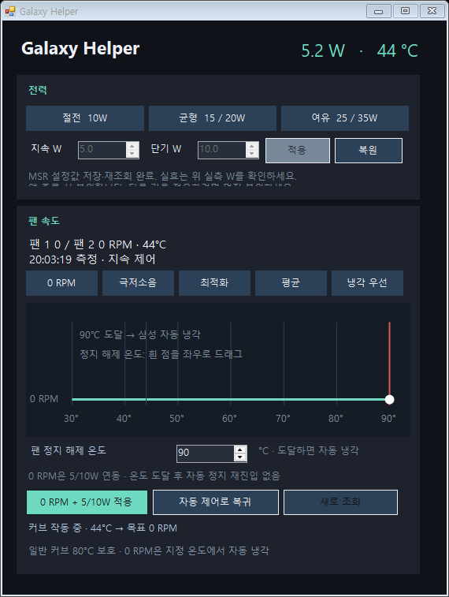

# Galaxy Book Helper

Galaxy Book6 Pro의 전력과 팬을 Windows에서 조절하는 실험용 도구입니다. G-Helper처럼 작은 창과 트레이에서 설정하며, 팬 RPM을 주기적으로 표시합니다.

현재 검증 대상은 **Galaxy Book6 Pro - PAMB / Core Ultra X7 358H / BIOS PAMB.1.5.74.371**입니다. 다른 모델·BIOS는 차단합니다.

## 기능

- 실제 RAPL PL1/PL2 전력 제한 및 원래 값 복원
- 두 팬의 RPM 조회, 실측 보정 기반 RPM 목표 제어
- 그래프에서 직접 편집하는 온도 커브와 극저소음·최적화·평균·냉각 우선 프리셋
- **0 RPM 프리셋**: 지속 5W / 단기 10W를 함께 적용하고, 지정 온도까지 팬 정지
- 스크롤 없는 컴팩트 UI, 트레이 메뉴, 종료 시 설정 복원

## EXE 첫 실행 자동 설정

팬 드라이버가 준비되면, 보정 기록이 없거나 만료된 PC에서는 **팬 자동 설정**이 시작됩니다. 유효한 기록이 있으면 바로 정상 화면을 엽니다. PowerShell이나 별도 CLI 실행은 필요하지 않습니다.

약 7~9분 동안 전력을 임시로 10/10W 이하로 낮추고 팬 단계별 RPM, 갱신 중단 시 자동 복귀, RPM 목표 유지를 검증합니다. 진행 창에서 취소할 수 있으며, 완료·취소·실패 시 팬 자동 복귀와 원래 전력 복원을 시도하고 결과를 확인합니다. 진행 중에는 부하 작업을 닫고 삼성 성능 모드를 바꾸지 마세요. 성공하면 커브가 즉시 활성화됩니다. ‘팬 설정’ 버튼과 트레이 메뉴로 다시 보정할 수도 있습니다.

이전 전력 복원 기록이 남아 있으면 자동 시작을 보류하고 ‘원래대로’로 복원하도록 안내합니다. 드라이버 설치 후 재부팅이 필요한 경우에는 기존 설치 안내를 따르세요. 보정은 드라이버 설치를 대신하지 않습니다.

진행·결과 기록은 `%LOCALAPPDATA%\GalaxyHelper\diagnostics`에 저장됩니다. 설치 폴더에 쓰기 권한이 없어도 실행할 수 있습니다.

## 자유 커브와 커스텀 프리셋

8개 점을 **좌우(온도)·상하(RPM)**로 이동하거나 그래프 아래 숫자를 직접 입력합니다. RPM 0부터 편집할 수 있으며 정지와 회전 구간을 같은 커브에 넣을 수 있습니다. Shift+드래그는 전체 이동, Ctrl+Z는 취소입니다.

**이름으로 저장**을 눌러 사용자 프리셋을 만들고 목록에서 불러오세요. 같은 이름으로 덮어쓰기와 사용자 프리셋 삭제를 지원합니다. 편집·프리셋 저장과 실제 적용은 구분되며, 하드웨어에 반영하려면 적용 버튼을 누릅니다.

실선은 요청값, 점선은 삼성에서 검증된 정지/회전 단계의 예상 속도입니다. 임의의 낮은 RPM을 편집할 수 있어도 실제 팬은 최저 회전 속도(현재 약3000 RPM)보다 느리게 돌지 않을 수 있습니다. [편집 방식·저장 위치·제어 범위](docs/CURVE-EDITOR.ko.md).
## 0 RPM 사용법과 현재 상태

1. 팬 영역의 프리셋 목록에서 **0 RPM**을 선택합니다.
2. **정지 해제**를 45~90°C로 설정합니다. 기본값은 90°C입니다.
3. **커브 + 5/10W 적용**을 누릅니다.
4. 지정 온도에 도달하면 삼성 자동 냉각으로 복귀합니다. 자동으로 팬 정지에 재진입하지 않습니다.

정지 시작은 해제 온도보다 5°C 이상 낮을 때만 허용됩니다. 드라이버가 PL1 ≤5W / PL2 ≤10W, 유효한 온도·RPM 센서와 5초 갱신 제한을 확인합니다. 전력 제한이 풀리거나 센서가 실패하거나 갱신이 멈추면 자동 제어로 복귀합니다. 일반 RPM 커브는 기존 80°C 보호 정책을 유지합니다. OEM 열 보호 설정은 변경하지 않습니다.

**2026-09-30 실기 검증 완료:** 재부팅 후 드라이버 **0.5.0.0**에서 실제 UI로 0 RPM + 5/10W를 적용했습니다. 60초 유지 시험의 58개 측정 모두 양 팬 **0 / 0 RPM**, CPU 온도 **41~53°C**, 드라이버 해제 온도 **90°C**를 확인했습니다. 시험 종료 후 전력과 팬 Auto 복원 및 화면 경계 검사도 통과했습니다. 앞선 별도 시험에서 정지 후 재시동도 확인했습니다. [검증 요약](docs/verification/zero-hold-2026-09-30.json). 90°C까지 직접 가열하는 시험이나 장시간 무팬 열 안정성 시험은 수행하지 않았습니다.



## 앱 빌드

Windows x64와 .NET Framework 4.x의 C# 컴파일러를 사용합니다.

```powershell
./tools/Fetch-PawnModules.ps1
./build.ps1 -OutputDirectory bin-next
./bin-next/GalaxyHardware.exe self-test
```

출력은 `bin-next/GalaxyHelper.exe`(UI)와 `GalaxyHardware.exe`(진단 CLI)입니다. 하드웨어 접근에는 별도로 설치한 공식 [PawnIO](https://pawnio.eu/)와 이 프로젝트의 모델 전용 팬 드라이버가 필요합니다. 앱 빌드와 오프라인 테스트는 드라이버를 설치하거나 하드웨어를 변경하지 않습니다.

`GalaxyPolicy.exe`는 초기 Windows 전원 정책 도구이며, 실제 RAPL 제어 UI는 `GalaxyHelper.exe`입니다.

## 팬 드라이버 개발

- `driver/GalaxyFanRead/`: ACPI 필터와 제한된 팬 명령
- `driver/FanControl/`: 팬 단계·갱신·복원 공통 정책
- `driver/FanZero/`: 30초 한정 0 RPM 검증용 버전
- `driver/FanZeroHold/`: 온도 기준 지속 정지 버전

현재 패키징·설치 스크립트는 개발 장비의 WDK 경로, 테스트 서명 인증서 지문, 모델/BIOS 및 패키지 해시에 고정되어 있습니다. 범용 설치 프로그램이 아닙니다. 인증서나 개인 키, 서명된 드라이버 바이너리는 저장소에 포함하지 않습니다. 자세한 프로토콜은 [0 RPM 드라이버 설명](driver/FanZeroHold/README.ko.md)을 참조하세요.

## 검증

- 앱 오프라인 테스트 **41개**, 편집·프리셋 UI 테스트 및 자동 설정 UI 테스트
- 지속 정지 네이티브 정책 **46개**, 기존 한시 정지 **22개**, 일반 팬 정책 **14개**
- 드라이버 정적 분석·INF·카탈로그 서명 검사
- 화면 경계 검사, 0 RPM UI 미리보기; 매우 작은 작업 영역에서는 버튼 잘림 대신 스크롤 제공

실기 진단·부하 시험 스크립트는 실제 전력이나 팬 설정을 변경합니다. CI에서는 실행하지 않습니다. 창의 X는 트레이로 숨기며, 실제 종료는 **트레이 → 종료 및 설정 복원**입니다.

## 의존성과 연구 자료

공식 PawnIO.Modules 0.2.11의 두 모듈을 SHA-256으로 검증해 내려받습니다. 출처·라이선스는 [NOTICE](dependencies/pawnio/NOTICE.md)에 있습니다. 연구 기록은 [docs](docs)에 있으며 초기 단계의 제한과 가설을 포함합니다. 최신 지원 상태는 이 README를 기준으로 합니다.
